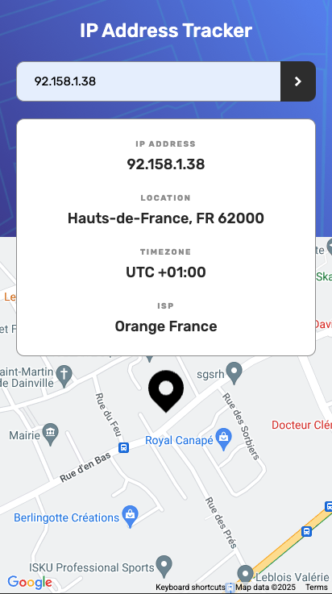
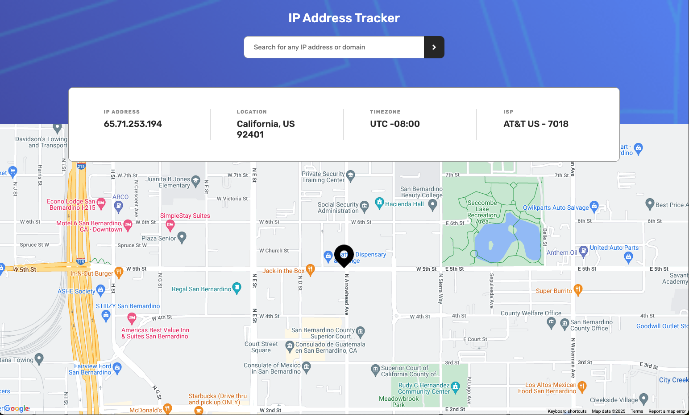

# Frontend Mentor - IP address tracker solution

This is a solution to the [IP address tracker challenge on Frontend Mentor](https://www.frontendmentor.io/challenges/ip-address-tracker-I8-0yYAH0).

## Table of contents

- [Overview](#overview)
  - [The challenge](#the-challenge)
  - [Screenshot](#screenshot)
  - [Links](#links)
- [My process](#my-process)
  - [Built with](#built-with)
  - [What I learned](#what-i-learned)
  - [Continued development](#continued-development)
  - [Useful resources](#useful-resources)
- [Author](#author)

## Overview

### The challenge

Users should be able to:

- View the optimal layout for each page depending on their device's screen size
- See hover states for all interactive elements on the page
- See their own IP address on the map on the initial page load
- Search for any IP addresses or domains and see the key information and location

### Screenshot

### Links

- Solution URL: [GitHub Repo](https://github.com/austenpturner/IPAddressTracker)
- Live Site URL: [IP Address Tracker](https://austenpturner.github.io/IPAddressTracker/)

## My process

1. Using Vite + React to create a react app and deleting starter files and code
2. Installing sass then setting up global and util folders that include boilerplate styles, breakpoints, variables (colors + fonts), functions, and typography styles
3. Creating component files with scss modules
4. Setting up context for input and output states to give all components access
5. Writing custom hooks to fetch API data and access to screen width
6. Applying react-google-maps components to generate Google map based on IP address
7. Using gh-pages to build and deploy app

### Built with

- HTML5
- SCSS
- Flexbox
- Mobile-first workflow
- Vite + React
- Google Maps JavaScript API
- Google Maps React Component: [react-google-maps](https://visgl.github.io/react-google-maps/)
- [ipify API](https://www.ipify.org/)
- [IPinfo API](https://ipinfo.io/)

### What I learned

I was able to practice fetching data from APIs. I learned how to use the react-google-maps React component to display a location based on IP address.

### Continued development

Adding a function to check and validate the search input, only allowing a valid ip address and displaying error messages to user.

### Useful resources

- [ChatGPT](https://www.chatgpt.com) - I used ChatGPT to help me implement the Google map components.

## Author

Austen Turner - Frontend Developer

- Website - [Austen Turner Portfolio](https://austenpturner.github.io/portfolio/)
- Frontend Mentor - [@austenpturner](https://www.frontendmentor.io/profile/austenpturner)
- GitHub - [austenpturner](https://github.com/austenpturner)
